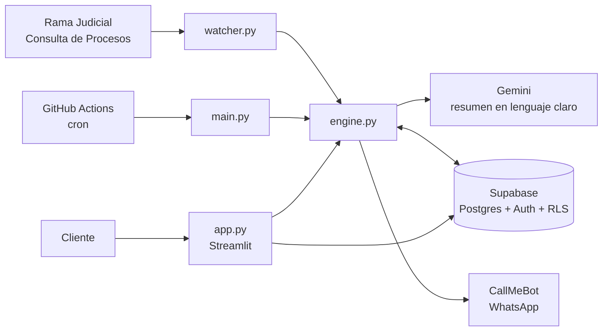

<div align="center">


# Claria Faro

**Vigilancia de procesos judiciales colombianos, explicada en lenguaje claro y entregada en tu WhatsApp.**


</div>

---

## ¿Qué es?

Claria Faro revisa periódicamente los procesos que registras en la **Rama Judicial de Colombia**, detecta cada actuación nueva y te la envía por **WhatsApp** con un resumen en lenguaje claro: qué pasó, si hay que hacer algo y, cuando aplica, en cuántos días.

Está pensado para dos públicos: **abogados** que no quieren revisar portales todos los días, y **personas que no son abogadas** y necesitan entender qué ocurre en su proceso sin descifrar la jerga.

> **English summary.** Claria Faro is a multi-tenant legal-tech app for Colombia. It polls the public Rama Judicial case-lookup service, summarizes each new court action in plain Spanish with Google Gemini, and notifies each user on their own WhatsApp number. Built with Python, Streamlit, Supabase (Auth + Postgres with Row Level Security) and GitHub Actions.

## Características

- **Avisos por WhatsApp** con juzgado, partes, clase de proceso, resumen y acción sugerida. El resumen tiene **35 palabras** y llega a **70** cuando alguna parte debe actuar.
- **Vencimientos y calendario**: cuando la actuación fija un término, el aviso trae la fecha y un enlace para añadirla a Google Calendar; en la app también se descarga un archivo `.ics` (Apple, Outlook, Google) y hay una lista de próximos vencimientos.
- **Resumen diario** de lunes a viernes a las 8 a.m. (hora de Colombia), incluso cuando no hay novedades.
- **Multiusuario**: cada cliente tiene su cuenta y conecta **su propio** número y su propia clave de CallMeBot. Los datos están aislados con Row Level Security.
- **Revisión automática** cada 6 horas con GitHub Actions, sin servidores propios.
- **Sin avalancha de mensajes**: al registrar un proceso solo se notifica lo más reciente; el historial se guarda en silencio.
- **Detección robusta**: una actuación es nueva si no está guardada, sin depender de su fecha, para no perder autos publicados con fecha atrasada.
- **Planes con límite** de procesos por cuenta, validado en la base de datos.
- **Resiliencia**: si Gemini falla se guarda un resumen de respaldo; si WhatsApp falla, el aviso se reintenta en el siguiente ciclo.

## Ejemplo de aviso

```
⚖️ CLARIA · Faro
━━━━━━━━━━━━━━━
📁 Proceso: Pérez vs. Gómez
🔢 Radicado: 05001-31-03-001-2020-00123-00
🏛️ Juzgado: Juzgado 1 Civil del Circuito
📂 Clase: Declarativo · Verbal
👥 Partes:
   • Demandante: Juan Pérez
   • Demandado: María Gómez
📅 Fecha: 2026-09-18
━━━━━━━━━━━━━━━
📌 Tipo: Traslado de excepciones

📝 ¿Qué pasó?
El demandado presentó excepciones. Se abre un plazo para que respondas.

🟠 ACCIÓN REQUERIDA
👉 Preparar la respuesta a las excepciones.
⏳ Término: 10 días hábiles
🗓️ Vence aprox.: vie 2 oct 2026
Fecha estimada: confírmala en el expediente.
📆 Añadir al calendario:
https://calendar.google.com/calendar/render?action=TEMPLATE&...
━━━━━━━━━━━━━━━
Verifica siempre en el expediente oficial.
```

## Cómo funciona



1. El cliente inicia sesión en la app web, conecta su WhatsApp y registra un radicado (23 dígitos).
2. Cada 6 horas, GitHub Actions ejecuta `main.py`, que recorre los procesos activos de todos los clientes.
3. `watcher.py` consulta la Rama Judicial; `engine.py` compara con lo ya guardado para encontrar lo nuevo.
4. `ai.py` genera el resumen estructurado con Gemini; `db.py` lo guarda en Supabase.
5. `wpp.py` arma la tarjeta y la envía al WhatsApp del cliente.

## Vencimientos: cómo se calculan las fechas

**La IA no calcula fechas.** Solo extrae del texto de la actuación los días concedidos (`dias_termino`) y, si el texto la indica completa, una fecha concreta (`fecha_limite`). Las fechas las calcula `calendario.py`, de forma determinista:

- **Fecha indicada en el texto** (por ejemplo, una audiencia): se usa tal cual, tras validarla.
- **Término en días**: se cuenta desde el día hábil siguiente a la fecha de la actuación, sin sábados, domingos ni festivos de Colombia. Por defecto, "días" se entiende como días hábiles.
- **Vacancia judicial**: si el término cruza la vacancia de fin de año (20 dic – 10 ene), no se calcula fecha y se avisa al usuario.
- Los términos en meses, años o días calendario no generan fecha: la IA los deja en 0 y lo explica en la acción sugerida.

Las fechas calculadas siempre se muestran como **estimadas**. No consideran cierres del despacho ni particularidades de cada tipo de término.

> Los festivos vienen de la librería `holidays`. Manténla actualizada: Colombia ha agregado festivos por ley (por ejemplo, el de la Virgen de Chiquinquirá desde 2026).

## Stack

| Capa | Tecnología |
|---|---|
| Interfaz | [Streamlit](https://streamlit.io) |
| Base de datos y autenticación | [Supabase](https://supabase.com) (Postgres, Auth, Row Level Security) |
| IA | [Google Gemini](https://ai.google.dev) mediante `google-genai` |
| Calendario hábil | [`holidays`](https://pypi.org/project/holidays/) (festivos de Colombia) |
| Mensajería | [CallMeBot](https://www.callmebot.com/blog/free-api-whatsapp-messages/) (WhatsApp) |
| Automatización | GitHub Actions |
| Fuente de datos | Consulta de Procesos Nacional Unificada, Rama Judicial |

## Estructura del repositorio

```
.
├── app.py                 # Interfaz web (Streamlit)
├── main.py                # Worker: revisión automática y resumen diario
├── engine.py              # Lógica de revisión, compartida por app y worker
├── watcher.py             # Cliente de la Rama Judicial
├── ai.py                  # Análisis de actuaciones con Gemini
├── wpp.py                 # Formato y envío de mensajes de WhatsApp
├── resumen_diario.py      # Resumen de las 8 a.m.
├── calendario.py          # Fechas de vencimiento, enlaces de Google Calendar y archivos .ics
├── db.py                  # Capa de datos (Supabase)
├── schema.sql             # Tablas, políticas RLS y límites por plan
├── assets/                # Logo y favicon
├── .streamlit/config.toml # Tema de la app
├── .github/workflows/
│   ├── revision.yml       # Revisión cada 6 horas
│   └── resumen-diario.yml # Resumen de lunes a viernes, 8 a.m. (Colombia)
├── requirements.txt
└── _env.example           # Plantilla de variables de entorno
```

## Puesta en marcha

### Requisitos

- Python 3.12 o superior
- Una cuenta gratuita de [Supabase](https://supabase.com)
- Una clave de [Google AI Studio](https://aistudio.google.com/apikey) (Gemini)
- Un repositorio en GitHub (para la revisión automática)

### 1. Base de datos

En Supabase, abre **SQL Editor**, pega el contenido de [`schema.sql`](schema.sql) y ejecútalo. Crea las tablas `perfiles`, `procesos` y `actuaciones`, las políticas de seguridad y el límite de procesos por plan. El script puede ejecutarse más de una vez.

> Si el esquema detecta las tablas de una versión anterior sin `user_id`, las elimina y las recrea. Esos datos no tienen dueño y no se pueden conservar.

### 2. Autenticación

En **Authentication** de Supabase:

- Deja activo el proveedor de correo.
- En **URL Configuration**, configura la *Site URL* con la dirección pública de tu app.
- En **Emails → Templates**, edita *Confirm signup* y *Reset password* para que incluyan el código con `{{ .Token }}`. La app pide ese código de 6 dígitos en lugar de usar enlaces.
- Para uso real, configura tu propio servidor SMTP en **Emails → SMTP Settings**. El correo integrado de Supabase es solo para pruebas y tiene límites muy bajos.

### 3. Variables de entorno

Copia `_env.example` a `.env` y complétalo:

| Variable | Dónde se usa | ¿Es secreta? |
|---|---|---|
| `SUPABASE_URL` | app y worker | No |
| `SUPABASE_ANON_KEY` | app web | No (la protege RLS) |
| `SUPABASE_SERVICE_KEY` | **solo el worker** | **Sí** |
| `GEMINI_API_KEY` | app y worker | **Sí** |
| `GEMINI_MODEL` | opcional, fuerza un modelo | No |

La clave de CallMeBot y el teléfono **no van aquí**: cada usuario los configura dentro de la app, en *Mi WhatsApp*.

### 4. Ejecutar en local

```bash
pip install -r requirements.txt
streamlit run app.py
```

Para lanzar una revisión o el resumen a mano (requiere `SUPABASE_SERVICE_KEY`):

```bash
python main.py            # revisa novedades y envía alertas
python main.py --resumen  # envía el resumen diario
```

### 5. Publicar la app

Puedes desplegarla en [Streamlit Community Cloud](https://streamlit.io/cloud) o en cualquier hosting que ejecute Streamlit. Configura como secretos `SUPABASE_URL`, `SUPABASE_ANON_KEY` y `GEMINI_API_KEY`. **No** pongas ahí la clave de servicio.

### 6. Revisión automática

En GitHub, ve a **Settings → Secrets and variables → Actions → Repository secrets** y crea `SUPABASE_URL`, `SUPABASE_SERVICE_KEY` y `GEMINI_API_KEY`. Los dos workflows de `.github/workflows/` hacen el resto. Puedes lanzarlos a mano desde la pestaña **Actions** para probarlos.

## Cómo conecta su WhatsApp cada usuario

1. Sigue la [guía oficial de CallMeBot](https://www.callmebot.com/blog/free-api-whatsapp-messages/) para autorizar el envío de mensajes y obtener su clave.
2. En la app, abre **Mi WhatsApp**, pega su número y su clave y guarda.
3. Pulsa **Enviar mensaje de prueba** para confirmar.

## Seguridad y privacidad

- **Aislamiento por usuario** con Row Level Security: cada sesión solo lee y escribe sus propios datos.
- **Plan y límite no editables** por el cliente: solo puede modificar su teléfono, su clave y la preferencia del resumen diario.
- La clave `service_role` de Supabase solo se usa en el worker, nunca en la app web.
- **Nunca** subas `.env` ni archivos con claves al repositorio. El `.gitignore` los excluye, pero no protege si subes archivos desde la web de GitHub.
- Las claves de CallMeBot se guardan **en texto plano** en `perfiles`, protegidas por RLS. Si vas a operar con clientes reales, considera cifrarlas (por ejemplo, con Supabase Vault).
- El texto de las actuaciones se envía a Google Gemini para generar el resumen.
- Quien despliega el proyecto es responsable del tratamiento de datos personales conforme a la normativa aplicable (en Colombia, la Ley 1581 de 2012).

## Limitaciones conocidas

- **La fuente de datos no es una API oficial.** El servicio de consulta de la Rama Judicial no está documentado y puede cambiar, limitar el acceso o bloquear ciertas conexiones, sobre todo desde servidores fuera de Colombia.
- **CallMeBot es un servicio gratuito y no oficial.** Es adecuado para pilotos, no para operar a escala. La hoja de ruta contempla la API oficial de WhatsApp.
- **Las fechas de vencimiento son estimadas.** La IA solo lee los días que concede el texto; la fecha se calcula con días hábiles y festivos, sin considerar cierres del despacho ni reglas propias de cada término. No reemplazan el control de plazos ni la revisión del expediente.
- La revisión ocurre **cada 6 horas**, no en tiempo real, y solo ve lo que ya está publicado en el portal.
- Solo se consulta la primera página de actuaciones de cada proceso.
- Las respuestas de la IA pueden contener errores.

## Hoja de ruta

- [ ] Revisión más frecuente en horario judicial
- [ ] Canal de respaldo por correo electrónico
- [ ] Migración a la API oficial de WhatsApp Business
- [ ] Cifrado de las claves de los usuarios
- [x] Fechas de vencimiento con días hábiles, festivos y enlace de calendario
- [ ] Reglas por tipo de término y vacancias distintas a la de fin de año
- [ ] Usar las fechas de inicio y fin de término del portal, si la fuente las expone de forma confiable
- [ ] Paginación completa de actuaciones
- [ ] Cobro y gestión de planes
- [ ] Pruebas automatizadas y CI

## Contribuir

Las ideas, los reportes de errores y los *pull requests* son bienvenidos.

1. Abre un *issue* describiendo el problema o la propuesta antes de un cambio grande.
2. Haz un *fork*, crea una rama y envía tu *pull request* con una descripción clara.
3. **No incluyas datos reales de procesos, radicados de personas ni claves** en *issues*, capturas o ejemplos.

## Aviso legal

Claria Faro es una herramienta **informativa**. No es asesoría jurídica ni reemplaza la revisión del expediente oficial ni el control de plazos por parte de un abogado. **No está afiliada, respaldada ni patrocinada** por la Rama Judicial de Colombia, Supabase, Google ni CallMeBot.

## Licencia

Por definir. Mientras no exista un archivo `LICENSE` en el repositorio, todos los derechos están reservados.

## Créditos

Creado por **Juan Vargas** · [Claria Legal Design](https://github.com/jvargaslop).
